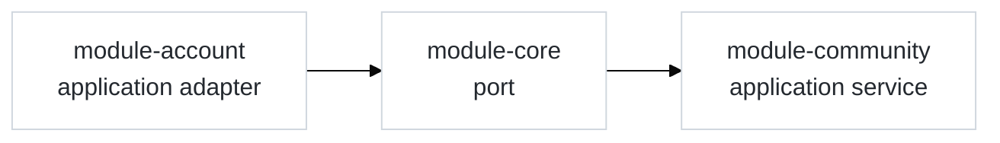

## 📝 Introduction

**BETA-Backend-Server**는 BETA 서비스 전반을 담당하는 백엔드 서버입니다.

Gradle 멀티 모듈 기반으로 구성되어 있으며  
사용자용 앱과 관리자용 웹의 API 진입점은 각각 `user-server`, `admin-server` 모듈이 담당합니다.

비즈니스 로직은 DDD 기반 레이어드 아키텍처를 바탕으로  
`module-account`, `module-community`, `module-search`, `module-core` 모듈로 나누어 관리합니다.

공통 응답과 예외 처리, 포트 기반 모듈 연동은 `module-core`에서 담당하며, 사용자 · 관리자 API는 각 서버 모듈이 필요한 도메인 모듈을 통해 처리합니다.

## 🛠️ Tech Stack

| Category | Stack |
| --- | --- |
| **Core** |    |
| **Security** |    |
| **Persistence / Query** |      |
| **Search Engine** |   |
| **Infrastructure / Deployment** |    |
| **Monitoring / Docs** |     |
| **External Services** |   |
| **Test** |    |

## 🧩 Module Structure

| Type | Module | Description |
| --- | --- | --- |
| **Server** | `user-server` | 사용자용 앱 API 진입점을 담당하는 서버 모듈 |
| **Server** | `admin-server` | 관리자용 웹 API 진입점을 담당하는 서버 모듈 |
| **Domain** | `module-core` | 공통 응답, 예외 처리, 포트 기반 모듈 연동을 담당하는 공통 모듈 |
| **Domain** | `module-account` | 계정, 인증 등 사용자 도메인을 담당하는 모듈 |
| **Domain** | `module-community` | 게시글, 댓글 등 커뮤니티 도메인을 담당하는 모듈 |
| **Domain** | `module-search` | Elasticsearch 기반 검색과 검색 로그를 담당하는 모듈 |
| **Support** | `buildSrc` | 공통 Gradle convention plugin을 관리하는 빌드 모듈 |

## 🏛️ Architecture

### Layered Architecture

| Layer | Role |
| --- | --- |
| `controller` | HTTP 요청/응답 처리와 API 진입점을 담당합니다. |
| `application` | 유스케이스, 서비스, 사용자/관리자 흐름 분리를 담당합니다. |
| `domain` | 엔티티와 핵심 비즈니스 규칙을 담당합니다. |
| `infra` | JPA, Redis, Elasticsearch, OCI, 외부 연동 구현을 담당합니다. |

BETA-Backend-Server는 DDD 기반 레이어드 아키텍처를 바탕으로  
API 진입점, 유스케이스, 도메인 로직, 외부 연동 책임을 분리해 관리합니다.

각 도메인 모듈은 `application`, `domain`, `infra`를 중심으로 나뉘며,  
엄격한 계층 분리보다 도메인 책임과 유지보수성을 우선해  
엔티티와 핵심 비즈니스 규칙은 `domain`, 저장소와 외부 시스템 연동은 `infra`에서 담당합니다.

일반 사용자와 관리자 흐름은 `user-server`, `admin-server`를 통해 진입한 뒤  
각 도메인 모듈의 `application` 레이어에서 유스케이스가 시작됩니다.  
`module-core`는 공통 모듈으로서 공통 응답, 예외 처리, 포트 기반 모듈 연동을 담당합니다.

### Module Interaction Flow

- 모듈 간 연동은 `module-core`에 정의된 포트를 기준으로 이루어집니다.
- 기능 제공과 호출 모두 각 도메인 모듈의 `application` 레이어를 중심으로 이루어집니다.
- 이를 통해 모듈 간 직접 참조를 줄이고, 도메인 책임을 분리해 관리합니다.

## ☁️ Infrastructure

OCI 환경에서 외부 진입 계층, 애플리케이션 계층, 데이터·검색 계층을 분리해 운영합니다.  
프록시 서버만 외부 요청을 직접 수신하고, 나머지 내부 서버들은 VCN 내부에서 프라이빗 네트워크 기반으로 통신합니다.  
네트워크는 Subnet과 NSG 기준으로 외부 공개 구간과 내부 서비스 구간을 분리해 관리합니다.

### System Flow

- 사용자 앱 요청은 프록시 서버를 통해 `user-server`로 라우팅됩니다.
- 관리자 웹의 정적 리소스는 프록시 서버에서 제공되며, 관리자 API 요청은 `admin-server`로 라우팅됩니다.
- `user-server`와 `admin-server`는 MySQL, Redis를 공통 데이터 저장소로 사용합니다.
- 검색 요청은 `user-server`가 Elasticsearch를 조회하는 방식으로 처리합니다.
- 검색 인덱스는 MySQL 변경분을 Logstash가 주기적으로 수집해 Elasticsearch에 반영하는 방식으로 동기화합니다.
- 모니터링은 사용자 API 서버의 Docker 환경에서 Prometheus, Grafana를 중심으로 운영하며, 관리자 API 서버도 동일한 흐름에 메트릭을 제공합니다.

## 🚀 Deployment

배포는 GitHub Actions 기반 파이프라인으로 운영합니다.  
사용자 서버와 관리자 서버는 각각 별도의 Docker 이미지로 빌드되며, 전용 배포 워크플로를 통해 OCI 운영 서버에 반영합니다.

- `deploy.yml`은 `main` 브랜치 반영 시 실행되며, `user-server` 이미지를 빌드·푸시한 뒤 사용자 API 서버 컨테이너를 재기동합니다.
- `deploy-admin.yml`은 수동 실행 방식으로 운영되며, `admin-server` 이미지를 빌드·푸시한 뒤 관리자 API 서버 컨테이너를 재기동합니다.
- 두 배포 흐름 모두 프록시 서버를 경유해 내부 운영 서버에 접속한 뒤 최신 이미지를 기준으로 컨테이너를 교체하는 방식으로 동작합니다.

## 📈 Monitoring

서비스 상태 확인과 메트릭 수집은 Spring Boot Actuator, Prometheus, Grafana 기반으로 운영합니다.  
`user-server`와 `admin-server`는 Actuator 및 Micrometer Prometheus Registry를 통해 모니터링 엔드포인트를 노출하고, Prometheus가 이를 주기적으로 수집합니다.  
Prometheus와 Grafana 구성은 Docker Compose 파일로 함께 관리하며, Grafana는 Prometheus를 데이터소스로 사용합니다.

- `user-server`, `admin-server`는 `/actuator/health`, `/actuator/info`, `/actuator/metrics`, `/actuator/prometheus` 엔드포인트를 노출합니다.
- Prometheus는 각 API 서버의 `/actuator/prometheus`를 scrape하여 애플리케이션 메트릭을 수집합니다.
- Grafana는 Prometheus를 기본 데이터소스로 사용해 운영 지표를 시각화합니다.

> Grafana 대시보드를 통해 `beta-user-server`, `beta-admin-server` 두 서버의 JVM, CPU, Load Average, HikariCP, HTTP 지표를 시각적으로 확인할 수 있습니다.

## 🧪 Testing

`JUnit 5`, `Mockito`, `Testcontainers`를 기반으로 단위 테스트, 통합 테스트, 컨트롤러 API 통합 테스트를 작성했습니다.  
테스트 환경은 검증 목적에 따라 `MySQL + Redis`, `MySQL + Elasticsearch`, `MySQL + Elasticsearch + Logstash` 조합으로 분리했습니다.

- Unit Test: 도메인 ㄴ서비스와 애플리케이션 서비스의 비즈니스 로직을 단위 수준에서 검증합니다.
- Integration Test: MySQL, Redis, Elasticsearch, Logstash 등 실제 인프라 연동이 포함된 흐름을 목적에 따라 검증합니다.
- Controller API Test: Spring Boot 테스트 환경에서 사용자/관리자 API 흐름을 통합 수준으로 검증합니다.
- Testcontainersㄹㅇㅁㄹㅁ Split: `MysqlRedisTestContainer`, `MysqlEsTestContainer`, `MysqlEsLogstashTestContainer`로 테스트 환경을 분리했습니다.
- Search Sync Test: Logstash polling 기반 MySQL → Elasticsearch 동기화 흐름을 별도 통합 테스트로 검증합니다.

