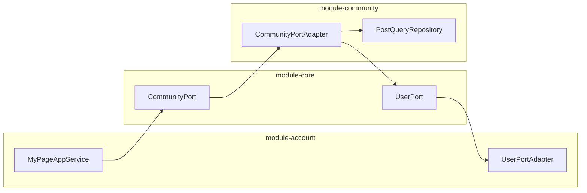

## Introduction

**BETA-Backend-Server**는 야구 팬 커뮤니티 BETA의 백엔드 서버입니다.

Gradle 멀티모듈 기반으로 구성되어 있으며, Port/Adapter 패턴을 통해 모듈 간 느슨한 결합을 유지합니다.
야구 시즌 중 트래픽 급증을 고려해, 추후 서비스 단위 분리가 가능한 구조로 설계했습니다.

사용자용 앱과 관리자용 웹의 API 진입점은 각각 `user-server`, `admin-server` 모듈이 담당하며,
비즈니스 로직은 `module-account`, `module-community`, `module-search`, `module-core` 모듈로 분리해 관리합니다.

## Tech Stack

| Category | Stack |
| --- | --- |
| **Core** |    |
| **Security** |    |
| **Persistence / Query** |      |
| **Search Engine** |    |
| **Infrastructure** |     |
| **Monitoring / Alerting** |     |
| **External Services** |   |
| **Test** |    |

## Module Structure

| Type | Module | Description |
| --- | --- | --- |
| **Server** | `user-server` | 사용자용 앱 API 진입점을 담당하는 서버 모듈 |
| **Server** | `admin-server` | 관리자용 웹 API 진입점을 담당하는 서버 모듈 |
| **Domain** | `module-core` | Port 인터페이스, 공통 예외, 보안, 알림 등 공통 인프라 모듈 |
| **Domain** | `module-account` | 계정, 소셜 인증, 디바이스 관리를 담당하는 모듈 |
| **Domain** | `module-community` | 게시글, 댓글, 감정표현, 멱등성 처리를 담당하는 모듈 |
| **Domain** | `module-search` | Elasticsearch 기반 검색과 검색 로그를 담당하는 모듈 |
| **Support** | `buildSrc` | 공통 Gradle convention plugin을 관리하는 빌드 모듈 |

## Architecture

### Port/Adapter 기반 모듈 연동

모듈 간 직접 참조를 금지하고, `module-core`에 정의된 Port 인터페이스를 통해 통신합니다.
각 모듈은 Adapter를 통해 Port를 구현하며, 이를 통해 순환 참조를 차단하고 모듈 교체를 용이하게 합니다.



| Port | 역할 | 구현 모듈 |
| --- | --- | --- |
| `UserPort` | 사용자 정보 조회 (작성자 정보 조합) | module-account |
| `CommunityPort` | 게시글 목록 조회 (마이페이지 등) | module-community |
| `PostPort` | 게시글 상세 조회 | module-community |
| `BlockPort` | 차단 여부 확인 | module-community |
| `PushPort` | FCM 푸시 알림 발송 | module-account |

### Layered Architecture

| Layer | Role |
| --- | --- |
| `controller` | HTTP 요청/응답 처리와 API 진입점을 담당합니다. |
| `application` | 유스케이스 오케스트레이션, 서비스 조합을 담당합니다. |
| `domain` | 엔티티와 핵심 비즈니스 규칙을 담당합니다. |
| `infra` | JPA, Redis, Elasticsearch, OCI, 외부 연동 구현을 담당합니다. |

## Infrastructure

OCI 환경에서 프록시 계층, 애플리케이션 계층, 데이터/모니터링 계층을 분리해 운영합니다.
프록시 서버만 외부 요청을 수신하고, 나머지 서버는 VCN 프라이빗 네트워크로 통신합니다.

### System Flow [(전체화면)](https://raw.githubusercontent.com/BETA-BasEball-Together-Always/BETA-Backend-Server/dev/docs/images/system-flow.svg)


### VM 구성

| VM | 역할 | 주요 구성 |
| --- | --- | --- |
| **proxy-vm** | Nginx 리버스 프록시, SSL 종료, 라우팅 | Let's Encrypt TLS, prefix 기반 라우팅 |
| **user-vm** | 사용자 API 서버 (Blue-Green + Dev) | beta-user-blue(8080), beta-user-green(8081), beta-user-dev(8082) |
| **admin-vm** | 관리자 API 서버 + 모니터링 | beta-admin, grafana, prometheus |
| **elk-vm** | 검색 엔진 + 로그 | elasticsearch, logstash, kibana |

### Nginx 라우팅

| 경로 | 대상 | 비고 |
| --- | --- | --- |
| `/api/*` | user-vm (Active-Standby) | blue=active, green=backup, 자동 failover |
| `/dev/api/*` | user-vm:8082 | Dev 서버, prefix rewrite |
| `/api/v1/admin/*` | admin-vm:8080 | 관리자 API |
| `/grafana/*` | admin-vm:3000 | 모니터링 대시보드 |
| `/kibana/*` | elk-vm:5601 | 검색 인덱스 조회 |

## Deployment

GitHub Actions 기반 CI/CD로 운영하며, 사용자 서버는 **Blue-Green 무중단 배포**를 적용합니다.

### Blue-Green 무중단 배포 (user-server)

```
main push → GitHub Actions
  │
  ├─ Build: JAR 빌드 → Docker 이미지 (linux/arm64) → Docker Hub push
  │
  └─ Deploy (proxy-vm SSH → user-vm):
      1. green(backup) 새 버전으로 교체 → health check 확인
      2. blue(active) 새 버전으로 교체 (green이 트래픽 커버)
      3. blue health check 확인 → 배포 완료
      4. dangling 이미지 정리
```

- **Active-Standby**: blue 장애 시 nginx가 green으로 자동 failover (`max_fails=2, fail_timeout=5s`)
- **Health Check**: `/actuator/health` 기반, 10초 간격 6회 재시도
- **Backup 리소스 최소화**: green 컨테이너는 HikariCP `max_pool=3, min_idle=1`로 DB 커넥션 절약

### Dev 서버 배포

- `dev` 브랜치 push 시 자동 배포
- Docker 이미지 `:dev` 태그, user-vm:8082 포트
- 전용 DB 스키마(`beta_dev`), 단일 컨테이너 (중단 허용)

### Admin 서버 배포

- `workflow_dispatch` 수동 트리거
- admin-vm에 단일 컨테이너 재기동

## Monitoring & Alerting

모니터링 스택(Prometheus, Grafana)은 user-vm과 분리하여 **admin-vm에서 운영**합니다.
user-vm 장애 시에도 모니터링 도구로 상태 확인이 가능합니다.

### 장애 감지 파이프라인

| 단계 | 수단 | 반응 시간 |
| --- | --- | --- |
| 즉시 알림 | Discord Webhook (GlobalExceptionHandler 연동) | 수 초 |
| 실시간 모니터링 | Grafana 대시보드 (Prometheus 메트릭) | 10초 주기 |
| 자동 복구 | Nginx failover (Active → Backup 전환) | 5초 이내 |

### Discord 에러 알림

서버 에러 발생 시 비동기로 Discord에 알림을 전송합니다.

- **대상**: DB 연결 실패(503), DB 타임아웃(503), 서버 내부 오류(500)
- **중복 제거**: `ConcurrentHashMap` 기반, 동일 에러 60초 내 1회만 전송
- **비동기 처리**: `@Async("discordAlertExecutor")` — API 응답 지연 없음
- **prod 전용**: Webhook URL 미설정 시 무시 (dev 환경 영향 없음)

### Grafana 대시보드

| 패널 | 운영 목적 |
| --- | --- |
| HTTP 요청 수 (per second) | 트래픽 추이 확인 |
| HTTP 에러율 (5xx) | 장애 즉시 감지 |
| 응답 시간 P95/P99 | 사용자 체감 성능 확인 |
| JVM Heap/Non-Heap | 메모리 누수 감지 |
| GC Pause Time | GC 병목 확인 |
| HikariCP Connections | DB 커넥션 풀 모니터링 |
| API 요청 현황 (실시간) | 실시간 트래픽 분석 |
| 느린 API Top 5 | 최적화 대상 식별 |

## Key Features

### Redis 기반 멱등성 처리

네트워크 재시도, 중복 클릭으로 인한 게시글/댓글 중복 생성을 방지합니다.

- **방식**: Content-Based (SHA-256 해시) — 클라이언트 키 관리 불필요
- **저장소**: Redis SET NX + 30초 TTL (원자적 연산)
- **장애 처리**: Fail-Open (Redis 장애 시 요청 허용, 가용성 우선)
- **적용 범위**: 게시글(`userId:content`), 댓글(`userId:postId:content`)

### 이벤트 기반 알림 + Redis 스로틀링

- `@TransactionalEventListener(AFTER_COMMIT)` — DB 커밋 후에만 알림 발송 (롤백 시 미발송)
- Redis 스로틀링: 댓글 1분, 감정표현 5분 내 중복 알림 차단
- 키 구조: `notification:throttle:{TYPE}:{actorId}:{targetId}:{postId}` (게시글 단위 세밀 제어)

### 회원탈퇴 익명화

탈퇴 시 커뮤니티 데이터를 삭제하지 않고 익명화하여 보존합니다.

- **즉시**: 닉네임="탈퇴한 사용자", 개인정보 null 처리, 차단 관계 삭제
- **30일 후**: User/디바이스/동의 레코드 영구삭제, 게시글/댓글은 보존
- **조회 시**: `AuthorInfo.withdrawn()` 반환 — Response 구조 변경 없음 (클라이언트 수정 불필요)

## Testing

`JUnit 5`, `Mockito`, `Testcontainers`를 기반으로 단위 테스트, 통합 테스트, 컨트롤러 API 통합 테스트를 작성했습니다.

- **Unit Test**: 도메인 서비스와 애플리케이션 서비스의 비즈니스 로직을 검증합니다.
- **Integration Test**: MySQL, Redis, Elasticsearch 등 실제 인프라 연동 흐름을 검증합니다.
- **Controller API Test**: Spring Boot 테스트 환경에서 API 흐름을 통합 수준으로 검증합니다.
- **Testcontainers Split**: `MysqlRedisTestContainer`, `MysqlEsTestContainer`, `MysqlEsLogstashTestContainer`로 테스트 환경을 분리했습니다.
